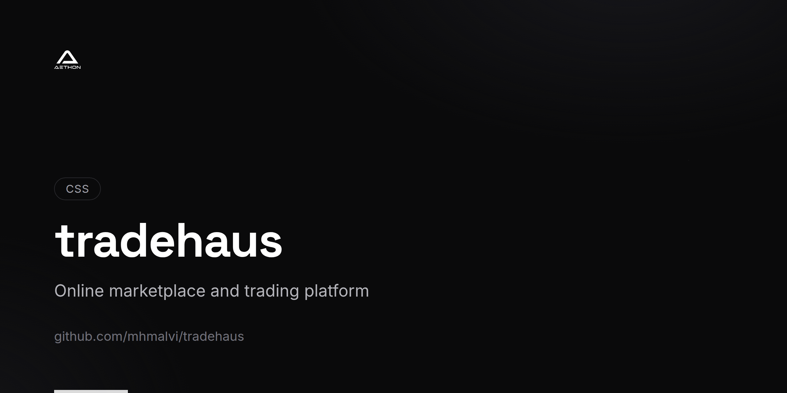

<!-- repo-card -->


# TradeHaus

A full-featured trading and marketplace platform built with Laravel 8. TradeHaus provides a complete e-commerce experience with product catalogs, shopping cart, order management, wishlists, blog system, and a comprehensive admin panel.

## Features

- **Product Catalog** — Browse products by category with search functionality and detailed product pages
- **Shopping Cart** — Dynamic cart with AJAX quantity updates and real-time total calculations
- **Order Management** — Complete checkout flow with order placement, tracking, and history
- **Wishlist** — Save favorite products for later purchase
- **Admin Dashboard** — Full back-office panel for managing products, categories, orders, and content
- **Blog System** — Admin-managed blog with comment support for content marketing
- **New Arrivals** — Dedicated section for featuring latest products with CRUD management
- **User Authentication** — Registration, login, and role-based access control (customer/admin)
- **Category Management** — Hierarchical categories with sub-category support
- **Order Tracking** — Customers can track order status and view order details
- **Content Pages** — About Us, Contact Us, Privacy Policy, Terms & Conditions, and FAQ pages
- **Offers & Promotions** — Dedicated offers page for marketing campaigns

## Tech Stack

| Component | Technology |
|-----------|------------|
| Framework | Laravel 8 |
| Language | PHP 7.3+ / 8.0 |
| Frontend | Blade, Livewire |
| UI Components | SweetAlert2 |
| Authentication | Laravel Breeze, Laravel UI |
| Database | MySQL |
| ORM | Eloquent |

## Prerequisites

- PHP 7.3+ or 8.0
- Composer
- MySQL 5.7+
- Node.js (for asset compilation)

## Getting Started

### 1. Clone the Repository

```bash
git clone https://github.com/mhmalvi/tradehaus.git
cd tradehaus
```

### 2. Install Dependencies

```bash
composer install
npm install && npm run dev
```

### 3. Configure Environment

```bash
cp .env.example .env
php artisan key:generate
```

Edit `.env` with your database credentials:

```env
DB_CONNECTION=mysql
DB_HOST=127.0.0.1
DB_DATABASE=tradehaus
DB_USERNAME=root
DB_PASSWORD=
```

### 4. Run Migrations and Seeders

```bash
php artisan migrate --seed
```

### 5. Start the Server

```bash
php artisan serve
```

The application will be available at `http://localhost:8000`.

## Key Routes

### Storefront

| Route | Description |
|-------|-------------|
| `/` | Homepage with product listings |
| `/product-details/{id}` | Product detail page |
| `/product_by_category/{id}` | Products filtered by category |
| `/search-item` | Product search |
| `/cart-items` | Shopping cart |
| `/checkout/{total}` | Checkout page |
| `/blog-all` | Blog listing |
| `/new-arrival/{slug}` | New arrival details |
| `/offer` | Offers and promotions |

### Admin Panel

| Route | Description |
|-------|-------------|
| `/admin/dashboard` | Admin dashboard |
| `/admin/add-product` | Add new product |
| `/admin/get-productList` | Product management |
| `/admin/add-category` | Category management |
| `/admin/new-order` | New order processing |
| `/admin/order-history` | Order history |
| `/admin/add-blog` | Blog management |
| `/admin/new-arrival` | New arrivals management |

## Project Structure

```
tradehaus/
├── app/
│   ├── Console/Commands/         # Artisan commands (cart cleanup)
│   ├── Http/
│   │   ├── Controllers/          # Storefront controllers
│   │   ├── Controllers/admin/    # Admin panel controllers
│   │   └── Middleware/            # Auth middleware
│   └── Models/                   # Eloquent models
├── database/
│   ├── factories/                # Model factories
│   ├── migrations/               # Database migrations
│   └── seeders/                  # Database seeders
├── resources/views/              # Blade templates
├── routes/web.php                # Web routes
└── composer.json
```

## License

This project is open source and available under the [MIT License](LICENSE).
